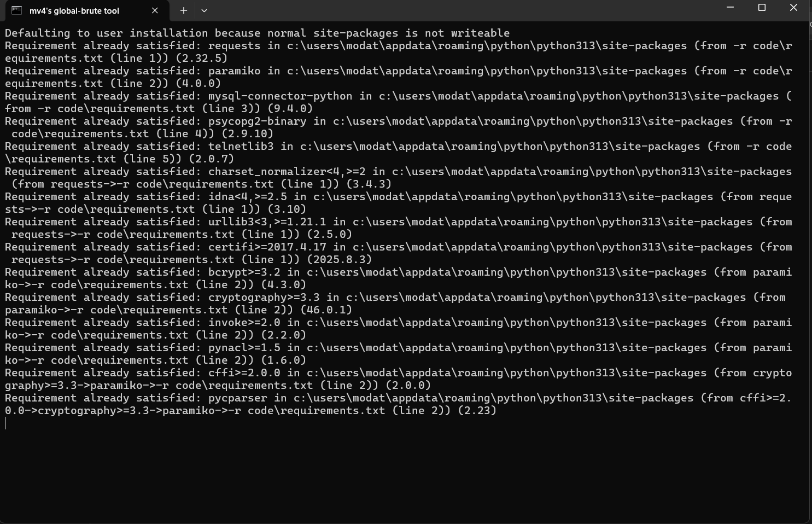
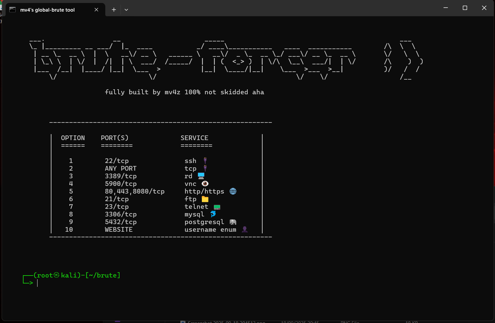

# global-brute 🌐

- global-brute is a brute-forcing tool which can brute many types of remote-desktop applications to get into somebodies computer remotely.

‎ ‎ 
# includes 📜
- ssh brute
- tcp brute
- rd brute
- vnc brute
- http/https brute
- ftp brute
- telnet brute
- mysql brute
- postgresql brute
- website username checkup

‎ 
# requirements 📜
- Windows 11 operating system
- Latest Python Version
‎ ‎ 
‎ ‎ 
‎ ‎ 
# installation 📖
- download python (latest version)
- once downloaded, use the wizard to guide you and properly install it to PATH.
- after, go to the main page of this script and press code, download as zip.
- once downloaded, unzip
- download PIP 
- wait for it to download...
- close and run global-brute.bat
- wait for libaries to install
- after everything downloads, the terminal should pop up with the tool
- enjoy!
‎ 
‎ ‎ ‎ 
‎ ‎ 
# usage 👤
- run the tool by executing the batch file:
   global-brute.bat
‎ ‎ ‎ 
‎ ‎ 
‎ ‎ 
# WARNING: ⚠️
do not start the .py by a ide. libaries will not install and time gets wasted.
‎ ‎ 
‎ ‎ 
‎ ‎ 
# documentation 🧑‍🏫
- see mv4zz on discord for detailed usage instructions and better analyis of this script 🪄
‎ 
‎ 
‎ 
# screenshots 📷
- bootup:

  
  
- main-menu:

  
  

# p.s
- use responsibily i am not in fault of any damage or recklessness
